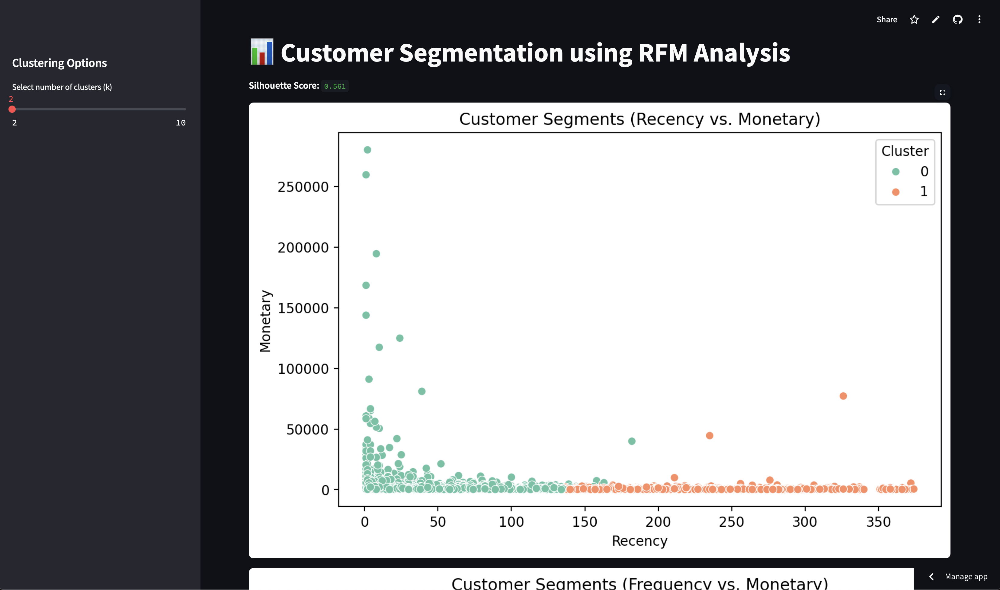

# 🧠 Customer Segmentation using RFM Analysis

This project performs customer segmentation using RFM (Recency, Frequency, Monetary) analysis on e-commerce transaction data. It leverages K-Means clustering and visualizes the segments using a Streamlit dashboard.



## 📁 Project Structure

```
customersegmentation/
├── cleaned_data.csv             # Cleaned e-commerce transaction data
├── data.csv                     # Raw dataset
├── CS2.py                       # RFM analysis and clustering logic
├── CS2_other.py                 # Alternative clustering script
├── streamlit_app.py             # Streamlit web application
├── requirements.txt             # Python dependencies
├── README.md                    # Project documentation
├── Figure_1                     # Application Screenshot
```
## 🔗 Streamlit Website

- https://customersegmentation01.streamlit.app
  
## 🚀 Features

- Performs feature extraction: Recency, Frequency, Monetary (RFM)
- Scales and clusters customers using KMeans
- Visualizes customer segments using seaborn and matplotlib
- Streamlit dashboard for interactive exploration
- Calculates Silhouette Score to evaluate clustering performance

## 📊 RFM Explained

- **Recency**: Number of days since the customer’s last purchase
- **Frequency**: Total number of unique transactions
- **Monetary**: Total amount spent by the customer

RFM is a proven technique to segment customers by their behavior and value.

## 🛠 Setup Instructions

### 1. Clone the Repository

```bash
git clone https://github.com/kirtikayush/customersegmentation.git
cd customersegmentation
```

### 2. Install Dependencies

It's recommended to use a virtual environment:

```bash
python -m venv venv
source venv/bin/activate  # On Windows: venv\Scripts\activate
pip install -r requirements.txt
```

### 3. Run the Streamlit App

```bash
streamlit run streamlit_app.py
```

> Make sure the `cleaned_data.csv` file is present in the root directory for the app to run properly.

## 🧪 Example Output

- **Silhouette Score**: Evaluates clustering performance
- **Cluster Visualizations**: Scatter plots for Recency vs. Monetary, PCA projections, etc.
- **Segment Profiles**: Insights into customer behavior across clusters

## 📁 Data Source

The dataset is based on UK-based e-commerce transaction data for retail purchases between 2010 and 2011.  

> Note: `cleaned_data.csv` is a processed version of the original raw data. Due to GitHub's 25MB file limit, consider using [Git LFS](https://git-lfs.github.com/) or storing the file in an external location if it exceeds the size limit.

---

⭐ If you found this project useful, feel free to star the repo and share your feedback!
